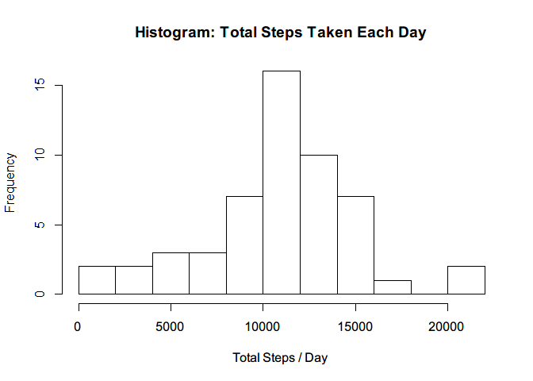

# Reproducible Research: Peer Assessment 1

## Loading and preprocessing the data

```r
#pacakges used
library(dplyr)
```

```
## 
## Attaching package: 'dplyr'
```

```
## The following objects are masked from 'package:stats':
## 
##     filter, lag
```

```
## The following objects are masked from 'package:base':
## 
##     intersect, setdiff, setequal, union
```

```r
library(ggplot2)
#unzip data file
unzip("activity.zip")
#read in data (tbl_df is useful for dplyr for a better structure)
adata <- tbl_df(read.csv("activity.csv", stringsAsFactors = FALSE))
#convert dates, using lubridate functions
adata$date <- as.Date(adata$date)
str(adata)
```

```
## Classes 'tbl_df', 'tbl' and 'data.frame':	17568 obs. of  3 variables:
##  $ steps   : int  NA NA NA NA NA NA NA NA NA NA ...
##  $ date    : Date, format: "2012-10-01" "2012-10-01" ...
##  $ interval: int  0 5 10 15 20 25 30 35 40 45 ...
```


## What is mean total number of steps taken per day?

```r
# Required steps:
# Calculate the total number of steps taken per day
# Make a histogram of the total number of steps taken each day
# Calculate and report the mean and median of the total number of steps taken per day
# Group and Summarize using dplyr functions 
adata_grouped <- adata %>% filter(!is.na(steps)) %>%  group_by(date)
total_steps_per_day <- summarise(adata_grouped, total_steps = sum(steps))
hist(total_steps_per_day$total_steps, ylab = "Frequency", xlab = "Total Steps / Day", 
     main = "Histogram: Total Steps Taken Each Day", breaks = 10)
```

<!-- -->

```r
mean_total_steps_per_day <- mean(total_steps_per_day$total_steps)
mean_total_steps_per_day
```

```
## [1] 10766.19
```

```r
median_total_steps_per_day <- median(total_steps_per_day$total_steps)
median_total_steps_per_day
```

```
## [1] 10765
```


## What is the average daily activity pattern?


## Imputing missing values


## Are there differences in activity patterns between weekdays and weekends?
