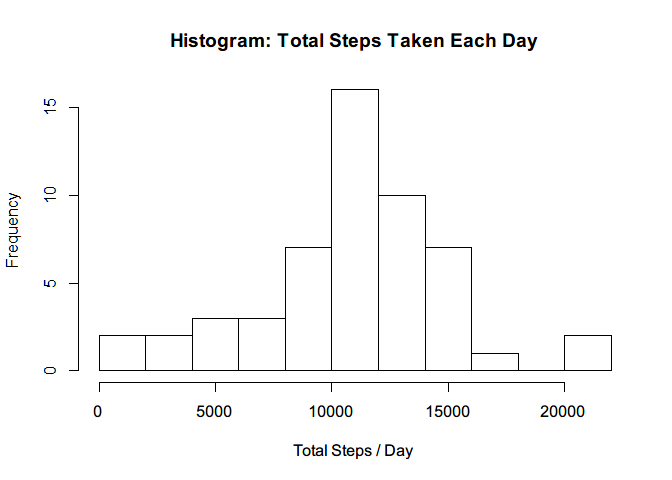
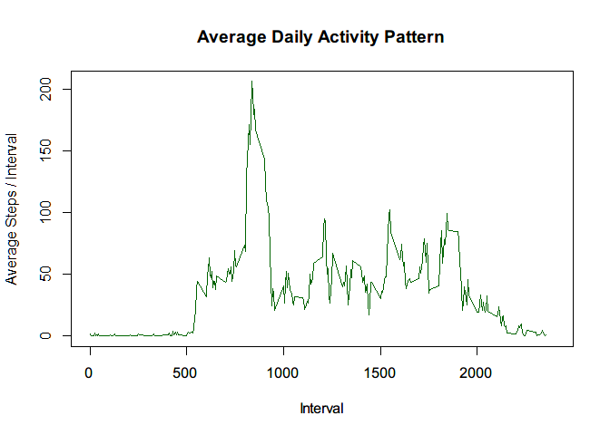
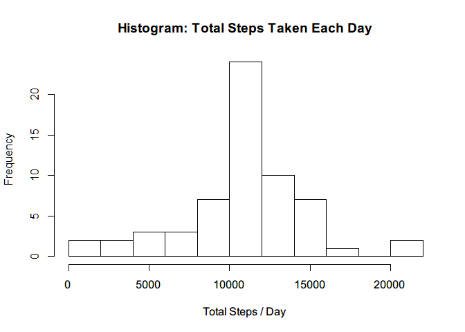
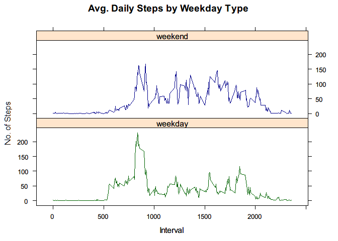

# Reproducible Research: Peer Assessment 1

## Loading and preprocessing the data
1. Load needed packages:

```r
library(dplyr)
```

```
## 
## Attaching package: 'dplyr'
```

```
## The following objects are masked from 'package:stats':
## 
##     filter, lag
```

```
## The following objects are masked from 'package:base':
## 
##     intersect, setdiff, setequal, union
```

```r
library(ggplot2)
```

2. Unzip data file and read data into R, convert dates from character to Date objects.


```r
#unzip data file
unzip("activity.zip")
#read in data (tbl_df is useful for dplyr for a better structure)
adata <- tbl_df(read.csv("activity.csv", stringsAsFactors = FALSE))
#convert dates
adata$date <- as.Date(adata$date)
str(adata)
```

```
## Classes 'tbl_df', 'tbl' and 'data.frame':	17568 obs. of  3 variables:
##  $ steps   : int  NA NA NA NA NA NA NA NA NA NA ...
##  $ date    : Date, format: "2012-10-01" "2012-10-01" ...
##  $ interval: int  0 5 10 15 20 25 30 35 40 45 ...
```

## What is mean total number of steps taken per day?
1. Calculate the total number of steps taken per day
2. Make a histogram of the total number of steps taken each day


```r
# Group and Summarize using dplyr functions 
adata_grouped <- adata %>% filter(!is.na(steps)) %>%  group_by(date)
total_steps_per_day <- summarise(adata_grouped, total_steps = sum(steps))
hist(total_steps_per_day$total_steps, ylab = "Frequency", xlab = "Total Steps / Day", 
     main = "Histogram: Total Steps Taken Each Day", breaks = 10)
```

<!-- -->

3. Calculate and report the mean and median of the total number of steps taken per day.

```r
mean_total_steps_per_day <- mean(total_steps_per_day$total_steps)
mean_total_steps_per_day
```

```
## [1] 10766.19
```

```r
median_total_steps_per_day <- median(total_steps_per_day$total_steps)
median_total_steps_per_day
```

```
## [1] 10765
```

## What is the average daily activity pattern?
Make a time series plot (i.e. type = "l") of the 5-minute interval (x-axis) and the average number of steps taken, averaged across all days (y-axis).


```r
adata_grouped <- adata %>% filter(!is.na(steps)) %>%  group_by(interval)
#mean across days 
average_across_days <- adata_grouped %>% summarise(average_steps_per_interval = mean(steps))
#time series
plot(average_across_days, type="l", col="darkgreen", ylab = "Average Steps / Interval",
     xlab = "Interval", main = "Average Daily Activity Pattern", xlim = c(0, 2400))
```

<!-- -->

Which 5-minute interval, on average across all the days in the dataset, contains the maximum number of steps?


```r
max_average_steps <- average_across_days[which.max(average_across_days$average_steps_per_interval),]
max_average_steps
```

```
## # A tibble: 1 × 2
##   interval average_steps_per_interval
##      <int>                      <dbl>
## 1      835                   206.1698
```
Interval _835 appears to have the maximum number of steps (206 steps)_, on average across all the days.

## Imputing missing values
1. Calculate and report the total number of missing values in the dataset (i.e. the total number of rows with NAs)

```r
sum(is.na(adata$steps))
```

```
## [1] 2304
```

2. Devise a strategy for filling in all of the missing values in the dataset. 
__The missing values would be imputed by re-using the dataset that we already created in the 
previous process - using mean for the 5-minute interval (across days)__
3. Create a new dataset that is equal to the original dataset but with the missing data filled in.


```r
adata_new <- adata
adata_new[is.na(adata$steps),1] <- average_across_days$average_steps_per_interval
sum(is.na(adata_new$steps))
```

```
## [1] 0
```

4. Make a histogram of the total number of steps taken each day and Calculate and report the mean and median total number of steps taken per day. 

```r
#Use dplyr to group by date and summarize to get totals
adata_new_grouped <- adata_new %>% group_by(date)
total_steps_per_day <- summarise(adata_new_grouped, total_steps = sum(steps))
hist(total_steps_per_day$total_steps, ylab = "Frequency", xlab = "Total Steps / Day", 
     main = "Histogram: Total Steps Taken Each Day", breaks = 10)
```

<!-- -->

```r
mean_total_steps_per_day <- mean(total_steps_per_day$total_steps)
mean_total_steps_per_day
```

```
## [1] 10766.19
```

```r
median_total_steps_per_day <- median(total_steps_per_day$total_steps)
median_total_steps_per_day
```

```
## [1] 10766.19
```

5. Do these values differ from the estimates from the first part of the assignment? What is the impact of imputing missing data on the estimates of the total daily number of steps?

__The values differ slightly from the first part but the overall distribution remains the same.__

## Are there differences in activity patterns between weekdays and weekends?
1. Create a new factor variable in the dataset with two levels – “weekday” and “weekend” indicating whether a given date is a weekday or weekend day.

```r
adata_new$weekday <- weekdays(adata_new$date)
adata_new$day_type <- as.factor(ifelse(adata_new$weekday == "Sunday" | adata_new$weekday == "Saturday","weekend", "weekday"))
```

2. Make a panel plot containing a time series plot (i.e. type = "l") of the 5-minute interval (x-axis) and the average number of steps taken, averaged across all weekday days or weekend days (y-axis). 

```r
#use dplyr to group by day type and then by interval
mean_steps_interval_daytype <- adata_new %>% group_by(day_type, interval) %>% 
  summarise(mean_steps = mean(steps))
#use lattice plotting system and create a panel plot
library(lattice)
xyplot(mean_steps~interval|day_type, mean_steps_interval_daytype, type="l",
       xlab = "Interval", ylab="No. of Steps", main="Avg. Daily Steps by Weekday Type",
       strip = TRUE, groups = day_type, col=c("darkgreen", "darkblue"),
       layout = c(1, 2))
```

<!-- -->

Conclusion: There's a difference between activity patterns. The individual appears to be active throughout the day on weekend days. For weekdays, there's a peak in activity pattern early in the day but individual appears to be less active during rest of the day compared to weekend days.
